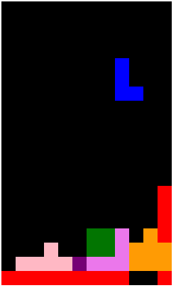

## TetrisGame in Javascript

### Running
* clone this repo
* npm install 
* npm start
* go to local host

### Guide
* q is counter-clockwise, w is clockwise
* left and right to move elements
* down is speed up dropping down 

### Play this game using chrome 
[View Live here](https://xinyu-tertrisgame.herokuapp.com/)

### In-app Screens

